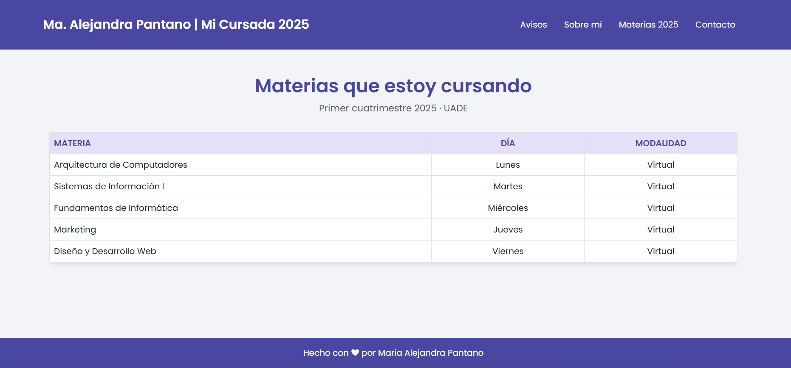

# DYDW1PARCIAL

📚 Mi Cursada 2025 | María Alejandra Pantano

Este sitio web fue creado para presentar la organización de mi cursada de materias del primer cuatrimestre 2025 de la carrera Licenciatura en Gestión IT en UADE.

Incluye información organizada de manera clara, responsive y adaptada a mi estilo personal.

🖥️ Tecnologías Utilizadas

HTML semántico

CSS

Bootstrap 5.3 (CDN)

Google Fonts: Poppins

Diseño Responsive

📄 Estructura del Sitio

Home: navegación general.

Sobre mí: presentación personal + intereses.

Avisos: calendario de entregas y parciales organizado en cards.

Materias 2025: materias cursadas, con enlace externo a página de la materia Diseño y Desarrollo Web.

Contacto: formulario funcional de contacto.

🎨 Principales Características de Estilo

Colores principales:

Violeta profundo #4a47a3 (header/footer/títulos)

Violeta suave #e5e0f7 (fondos destacados)

Grises neutros para textos secundarios

Tipografía:

Poppins para todo el sitio.

Elementos visuales:

Sombra suave en cards (box-shadow)

Bordes redondeados

Hover animado en botones y cards

Organización en grillas responsive

Enlaces destacados visualmente

📱 Responsive Design

Navbar adaptativa (menu hamburguesa en verisón mobile)

Cards de avisos reorganizadas a 1 columna en pantallas chicas

Ajuste de tamaños de fuentes en pantallas pequeñas

Imagen de perfil centrada en mobile

Formulario de contacto adaptado

🛠️ Buenas Prácticas Aplicadas

Código limpio y comentado

Nombres de clases claros y semánticos

Separación de responsabilidades: estructura (HTML) vs. estilos (CSS)

📸 Vista previa (Desktop)

🔗 Enlace a Github Pages: https://mapantano.github.io/DYDW1PARCIAL/

✨ Autora
María Alejandra Pantano

Proyecto personal para reflejar mi recorrido académico de la materia Diseño y Desarrollo Web durante el primer bimestre correspondiente al primer cuatrimestre del 2025.
